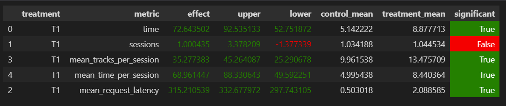

# Идея

Мой `Custom` рекомендер дополняет `Contextual`:
1. Логичнее рекомендовать треки, похожие на те, которые ему понравились. А не похожие на предыдущий, потому что он может и не понравиться. Поэтому вместо подбора рекомендаций по предыдущему треку, он подбирает рекомендации по последним `N` понравившимся трекам
2. Пользователю скорее всего не очень нравится слушать подряд одни и те же треки, поэтому рекомендер запоминает последние `M` треков, которые пользователь прослушал и не рекомендует их
3. Но если пользователю трек очень не понравился, чтобы он быстро не ушел, можно порекомендовать один из любимых треков, но не очень часто. Если пользоваетелю сильно не понравился предыдущий трек с определенной частотой он рекомендует трек из его любимых

# Реализация

В `track.py` добавлен `UserData` класс, который хранит историю пользователя и методы `add_listened_track` `add_liked_track` `reset_user_data`, 
которые изменяют данные пользователя.

В `server.py` добавлена база данных `user_data_redis`, которая хранит историю пользователя

### Рекомендер
1. Загружает `UserData` из базы данных
2. Проверяет если предыдущий трек не понравился, и вероятность выпала, то возвращает случайный из любимых треков
3. Собирает и загружает рекомендации из любимых треков в один список
4. Возвращает первый трек, который пользователь ещё не слушал

### Параметры рекомендера `Custom`:
1. `memory_listened_track_count` - размер хранилища для прослушанных треков (лучшее: `30`)
2. `memory_liked_track_count` - размер хранилища для понравившихся треков (лучшее: `30`)
3. `liked_track_memory_threshold` - минимальное время прослушивания трека, при котором трек считается понравившимся (лучшее: `0.9`)
4. `liked_track_frequency` - вероятность выдачи любимого трека (лучшее: `0.25`)
5. `liked_track_threshold` - максимальное время прослушивания трека, при котором трек считается НЕ понравившимся (лучшее: `0.3`)

### Результаты

